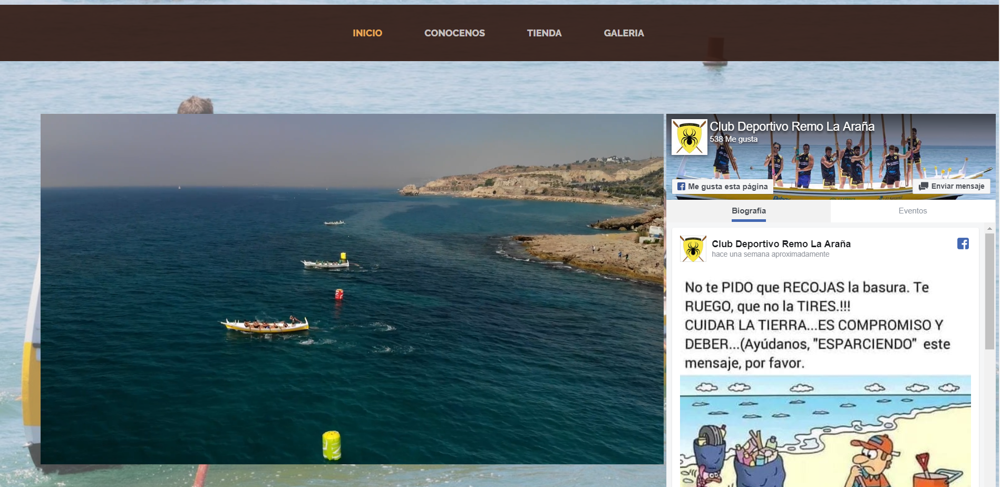
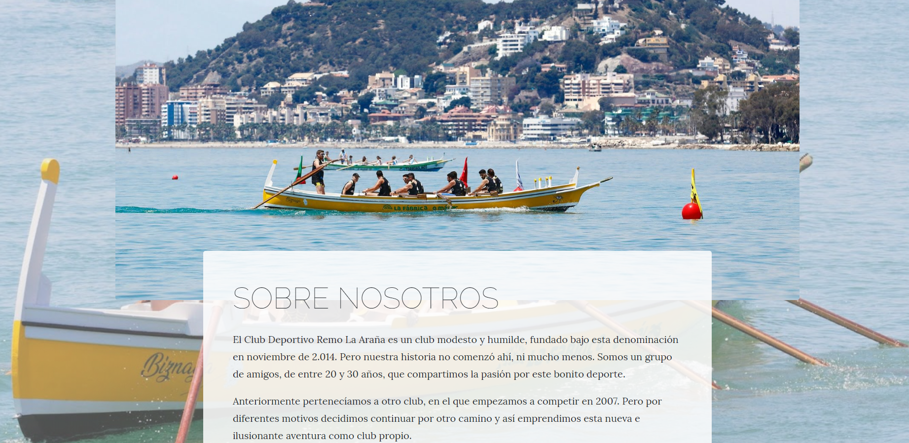
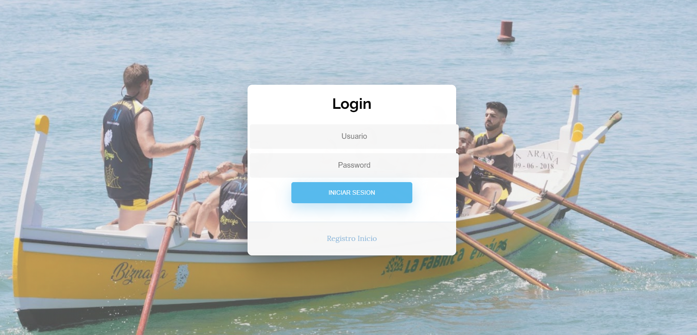
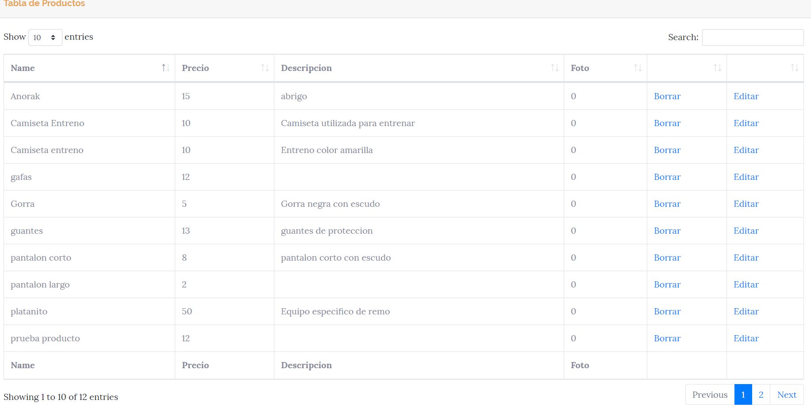
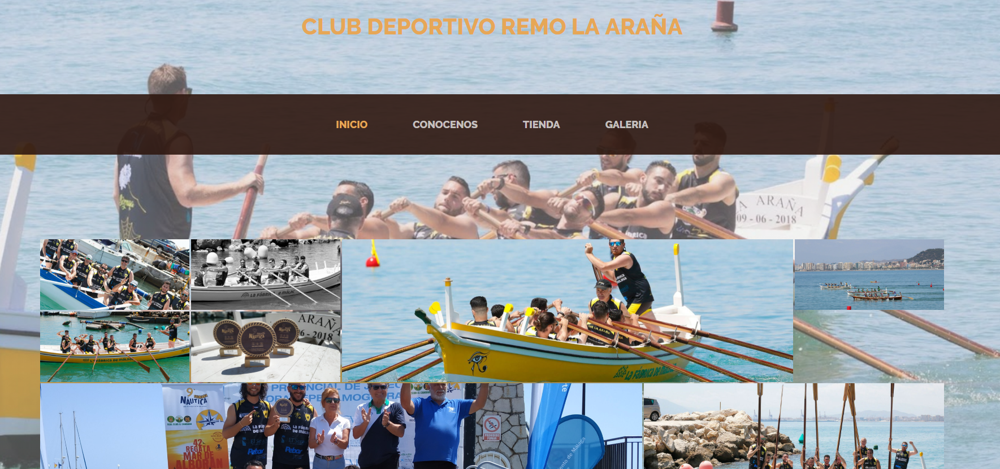

# Proyecto Final

En este proyecto he realizado una pagina en el que el tema es club deportivo de remo, donde en un principio encontramos
una vista principal con un video y un iframe de facebook para poder ver todas las publicaciones que se sube en la
cuenta de facebook. Ademas podemos ver cuatro apartados en la cabecera: inicio, conocenos,tienda y galeria.

# INICIO

En esta vista principal nos encontramos un video y al lado suya un iframe donde podemos ver todas las publicaciones
realizadas en su cuenta de facebook.

# CONOCENOS

En este apartado encontraremos varios contenedores con información sobre el club.

# TIENDA

En este apartado para acceder a la tienda nos solicita antes que nos loguemos, donde si no tenemos cuenta, nos aparece
un apartado para crear nuestra cuenta.

Hay dos tipos de usuarios:
  -El usuario administrador que es el que puede realizar acciones como crear un producto, editarlo
  o borrarlo de la tienda.(Usuario: admin   Contraseña:admin)
  Vista Administrador:
  
  
  
  -El usuario normal que se puede crear su cuenta y tiene una vista de todos los productos que puede añadir a su carrito.

# GALERIA

En este apartado vemos una pequeña galeria de imagenes redimensionadas formando como un pequeño mosaico.

# Herramientas utilizadas

- Como lenguaje de programacion he utilizado PHP utilizando el modelo MVC
- Para la realizacion de la vista de la pagina y el resposive he utilizado boostrap
- Para la paginacion he utilizado datatable,js y boostrap.
- Para el despliegue de la web he utilizado infinity free

# Enlace del proyecto desplegado con infinity free:

http://clubremo.epizy.com

